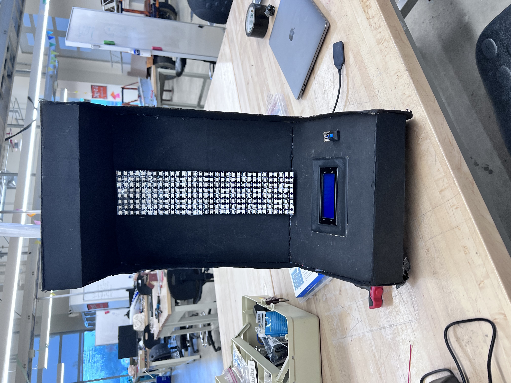

# Stacker Arcade Game

A two-microcontroller arcade game inspired by the classic **Stacker** game. The project combines a **PIC16F1829** and an **Arduino** to create a physical arcade-style game using an **8×32 WS2812B LED matrix**, an **I²C LCD**, a **push button**, and **UART communication** between the two microcontrollers.

The **PIC16F1829** handles the user interface, button input, LCD display, game level tracking, and communication with the Arduino. The **Arduino** controls the LED matrix and runs the main game mechanics, including block movement, overlap detection, speed progression, and win/loss detection.

## Demo

[Watch the Stacker Arcade Game Demo](docs/stacker_demo.mp4)

## Project Photos

---

## Project Overview

The objective of the game is to stack moving blocks from the bottom of the LED matrix to the top.

A block continuously moves left and right across the current row. When the player presses the button, the Arduino compares the moving block with the previously placed block.

Only the LEDs that overlap with the previous block remain. This causes the block to become smaller when the placement is not perfectly aligned.

If there is no overlap between the current block and the previous block, the player loses.

After every successful placement, the block moves to the next row and the game becomes faster.

The player wins by successfully stacking blocks all the way to the top of the 32-row matrix.

---

## System Architecture

                           ┌─────────────────┐
                           │   Push Button   │
                           └────────┬────────┘
                                    │
                                    ▼
                         ┌────────────────────┐
                         │     PIC16F1829     │
                         │                    │
                         │ • Button Input     │
                         │ • Debouncing       │
                         │ • I²C LCD          │
                         │ • Game Level       │
                         │ • UART Interface   │
                         └─────────┬──────────┘
                                   │
                                   │ UART
                                   │
                                   ▼
                         ┌────────────────────┐
                         │      Arduino       │
                         │                    │
                         │ • Game Logic       │
                         │ • Block Movement   │
                         │ • Overlap Logic    │
                         │ • Speed Control    │
                         │ • Win/Loss Logic   │
                         │ • FastLED Control  │
                         └─────────┬──────────┘
                                   │
                                   │ WS2812B Data
                                   ▼
                         ┌────────────────────┐
                         │    8 × 32 LED     │
                         │      Matrix        │
                         │     256 LEDs       │
                         └────────────────────┘

---

## Hardware Wiring

### Power Supply

The external power supply provides power to the LED matrix.

| Connection | Wire |
|---|---|
| Ground | Orange |
| Power | Red |

### WS2812B LED Matrix

| LED Matrix Pin | Connection |
|---|---|
| 5V | Power supply |
| GND | Ground |
| DATA | Arduino D6 |

The Arduino uses pin **D6** to send the WS2812B data signal to the LED matrix.

### UART Communication

The PIC16F1829 and Arduino communicate using UART.

| PIC16F1829 | Arduino |
|---|---|
| RC5 (TX) | D3 |
| RC4 (RX) | D2 |
| GND | GND |

The UART connection allows the PIC to send button/game commands to the Arduino and allows the Arduino to return game-status responses.

### Push Button

The push button is connected to the PIC16F1829.

| Button Connection | PIC16F1829 |
|---|---|
| Ground | VSS |
| Button signal | RA4 |

RA4 is configured as a digital input with the PIC's weak pull-up enabled.

### I²C LCD

The LCD is connected directly to the PIC16F1829 using I²C.

| LCD Pin | PIC16F1829 |
|---|---|
| GND | GND |
| VDD | VDD |
| SDA | SDA |
| SCL | SCL |